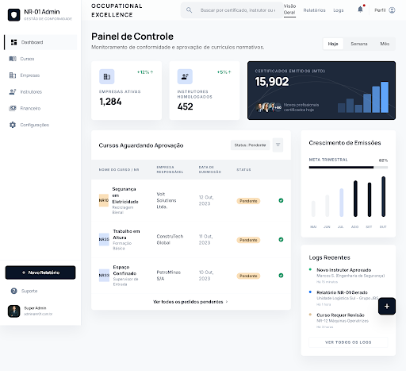

# Super Admin: Painel Financeiro Global

## 📸 Screenshot do Design Original

## 📋 Resumo do Design

### Métricas Principais (Top Cards)
1. **Empresas Ativas**: 1,284 (+12%)
2. **Instrutores Homologados**: 452 (+5%)
3. **Certificados Emitidos (MTD)**: 15,902 com gráfico de barras

### Seções Principais

#### 1. Cursos Aguardando Aprovação (Tabela)
- **NR10** - Segurança em Eletricidade (Volt Solutions Ltda.)
- **NR35** - Trabalho em Altura (ConstruTech Global)
- **NR33** - Espaço Confinado (PetroMinas S/A)

Cada linha tem botões de ação: ✅ Aprovar | ❌ Rejeitar | 👁️ Ver Detalhes

#### 2. Crescimento de Emissões (Gráfico)
- Meta Trimestral: 82%
- Gráfico de barras dos últimos 6 meses (Mai-Out)

#### 3. Logs Recentes
- Novo Instrutor Aprovado (15 min atrás)
- Relatório NR-01 Gerado (1 hora atrás)
- Curso Requer Revisão (3 horas atrás)

---

## ✅ Implementação React Criada

Arquivo: `SuperAdminDashboardFinance.jsx`

### Funcionalidades Implementadas:

✅ **Métricas Financeiras**
- Receita Total com crescimento
- Pedidos Pagos com ticket médio
- Licenças Ativas com gráfico visual

✅ **Pedidos Recentes (Tabela)**
- Empresa, Data, Itens, Licenças, Valor
- Ordenado por data mais recente

✅ **Crescimento de Receita (Gráfico)**
- Dados dos últimos 6 meses
- Barra de progresso da meta mensal

✅ **Top Empresas (Ranking)**
- Top 5 empresas por receita
- Total gasto e número de pedidos

✅ **Filtros de Período**
- Semana, Mês, Trimestre, Ano

### Design System Utilizado:
- ✅ Cores do Material Design 3
- ✅ Tailwind CSS com configuração customizada
- ✅ Google Fonts: Inter + Manrope
- ✅ Material Symbols Outlined
- ✅ Layout responsivo (grid 12 colunas)
